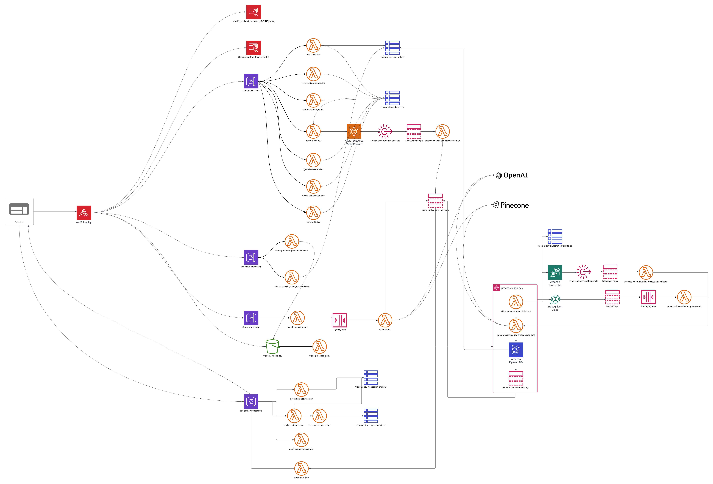

# Welcome to mixa-ai

## Introduction

Hello! My name is Isaac Johnson, and welcome to my capstone project, mixa-ai. Mixa-ai is a cloud-based, AI-powered video editing platform that leverages cutting-edge technologies in vision, language processing, and AI embeddings to offer a seamless video editing experience. This document is dedicated to providing a detailed technical overview of the project. So, get ready for a deep dive! For those interested in less technical details, the informational website contains a general overview of what mixa-ai does and the does and outline project goals. Please visit https://www.mixa-ai.com for more details.

Feel free to reach out to me on [LinkedIn](https://www.linkedin.com/in/isaac-johnson-0b09ab231/) or [Github](https://github.com/ipj-neu) with any questions!

This README is a work in progress and I am working to make sure it is as detailed as possible. If you have any questions or would like to know more about a specific part of the project please reach out to me!

# Tech Stack

## Frameworks and Cloud Providers

- ### AWS

  

    
Explanation

    AWS served as the cloud provider for this project. It provided critical services like Cognito Users, Lambdas, API Gateways, WebSocket Gateways, Rekognition Vision AI, and Media Covert. I also chose this to learn the platform better as it had intrigued me before the project. It was used in conjunction with Serverless Framework.
  

- ### Serverless Framework

  

    
Explanation

    Serverless Framework is an infrastructure as code framework for cloud platforms that allows cloud services to be defined as a config and can easily deploy and version your architecture. I chose this one as apposed to other popular IaC frameworks for it's capabilities of quickly setting up serverless architecture. I think if I where to do this project over I would look into the benefits of other IaC as I didn't weigh any other one before the project.
  

- ### Next.js React

  

    
Explanation

    Next.js React was used for the frontend web framework. Next.js provides a lot of utilities on top of React, making development smoother and a lot less boiler plate. Next.js also integrates with AWS Amplify which was used for hosting the website
  

- ### AWS Amplify
  

    
Explanation

    I mostly used AWS Amplify to integrate my Cognito auth and API Gateways into the frontend. It provided a nice frontend package for the quick implantation of both of those services.
  

## Programming Languages

- ### Python

  Python is the langues chosen for the backend of the project. I chose it for it's development and variety of well supported packages. In hindsight I think this was the right decision as a faster backend development speed allowed me to make a big pivot in the middle of project.

- ### Typescript
  Typescript was used for the in the React frontend of the project. Typescript was chosen for it's type safety and again for it's host of well supported packages. I find type safety in React to helpful and speed up development by preventing many small bugs before they even happen.

## Tools

- ### OpenAI

  OpenAI's API was used for it's GPT-4 language model and it's embedding model. This was used in conjunction with Pinecone DB to create a RAG model from the analyzed video's data.

- ### Pinecone DB

  Pinecone provided a cloud vector database that provide metadata and k-mean queries making the process of finding relevant data for user text quires much easier

### Changes to the tools

Midway through the project OpenAI introduced it's Assistants. I am using the Python package LangChain in the project currently. While this package made development a little easier with it's tools for embeddings, agents, and Pinecone, it has many issues and the main problems it was solving where solved by in introduction of Assistants. In the future, I would want to migrate to using Assistants.

# Back End Architecture

Back end architecture design was one of the skills I really wanted to practice in this project. While this back end is far from perfect, I learned a lot designing it and am excited to apply that learning to other projects! The goals of this back end were to keep the cost low using only serverless components and create more complex systems. Here is an image diagraming the final layout.

# How it works

## Uploading a video

1. User uploads a securely uploads a video to there authorized S3 folder
2. Videos are processed by Amazon Rekognition video AI and Amazon's video transcriber
3. Data is received and processed into a standard format
4. The standardized data is then sent to OpenAI's embedding model and an embedding embedding is received
5. Embedding is saved in a Pinecone cluster with the relevant metadata

This process is done as asynchronously as possible using an aws step function
